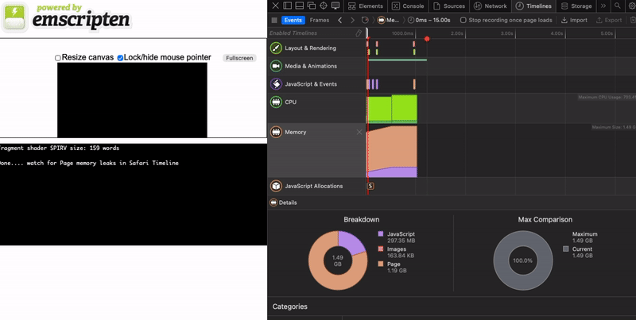

# Safari WebAssembly Memory Leak - Minimal Reproduction

Safari (26.2 and Tech Preview 234 on macOS and iOS) appears to have a pathological memory leak sometimes triggered by unaligned memory loads in WASM when `ASYNCIFY` is enabled. This repository reproduces one such case in [glslang](https://github.com/KhronosGroup/glslang/pull/4137), which under certain conditions causes Safari to continuously leak "Page" memory until the browser crashes with an out-of-memory error -- long after the WASM code has finished executing. This issue does not occur on Edge, Chrome or Firefox.



## Prerequisites

Install and activate Emscripten SDK:

```bash
git clone https://github.com/emscripten-core/emsdk.git
cd emsdk
./emsdk install latest
./emsdk activate latest
source ./emsdk_env.sh
```

Note, tested on `4.0.22`.

## Build

The particular issue in GLSlang is only triggered in Debug builds due to the `GUARD_BLOCKS` feature thats enabled then. This feature also causes `SAFE_HEAP` to throw faults.

```bash
emcmake cmake -B build -DCMAKE_BUILD_TYPE=Debug
cmake --build build -j8
```

## Run

Start the local server (required for SharedArrayBuffer headers):

```bash
python3 serve.py
```
